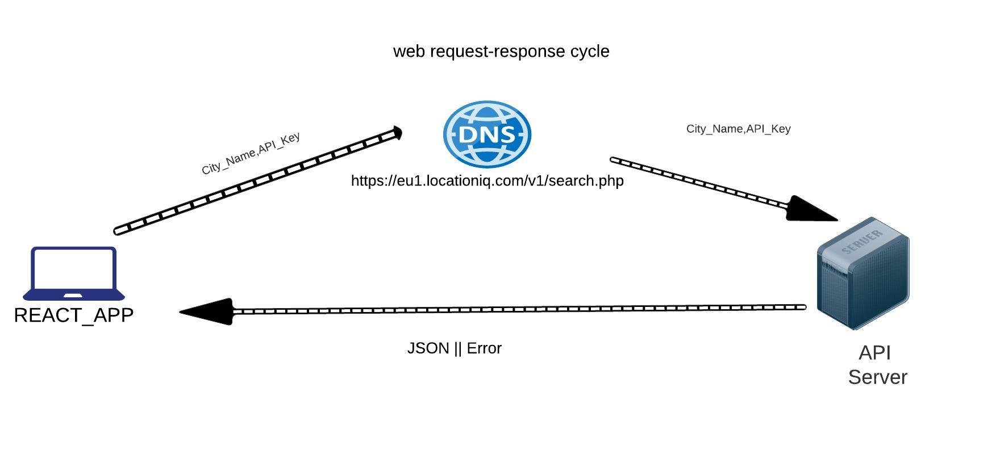

# Project Name: city-explorer

**Author**: Ali Rahhal
**Version**: 1.0.0 

## Overview
* City Explorer is a website that can display the terrain of a country or a city or an area.

## Getting Started
<!-- What are the steps that a user must take in order to build this app on their own machine and get it running? -->

## Architecture

## Change Log

## Credit and Collaborations

Lab6:

Name of feature:Asynchronous code, and APIs

Estimate of time needed to complete: 1:30

Start time: 1:45

Finish time:4:30

Actual time needed to complete: 2:45
