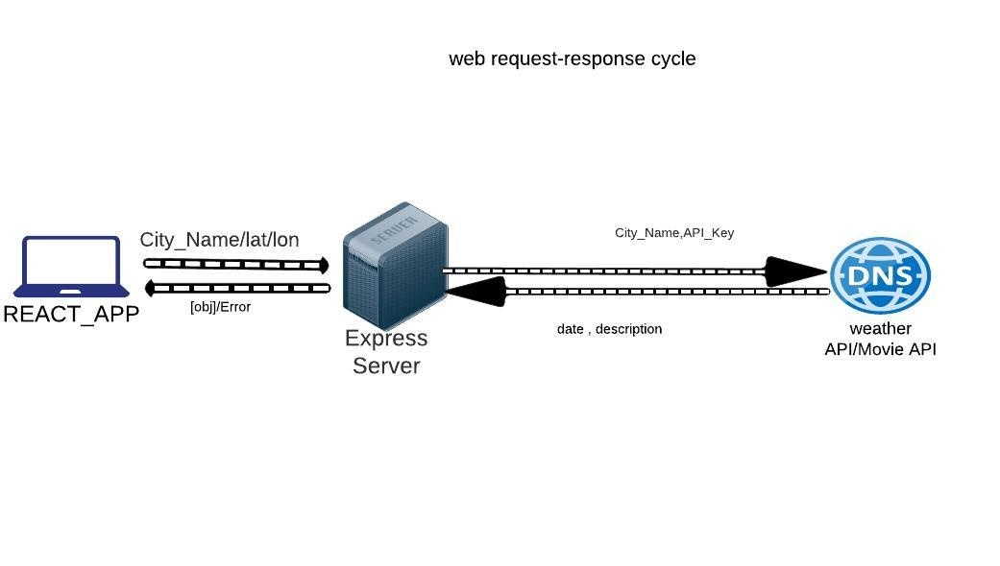

# Project Name: city-explorer

**Author**: Ali Rahhal
**Version**: 1.0.2

## Overview

* City Explorer is a website that can display the terrain of a country or a city or an area.
* Get all the movies that related with this city

## Getting Started
<!-- What are the steps that a user must take in order to build this app on their own machine and get it running? -->

## Architecture

lab6:

lab 7-8:

## Change Log

## Credit and Collaborations

Lab6:

Name of feature:Asynchronous code, and APIs

Estimate of time needed to complete: 1:30

Start time: 1:45

Finish time:4:30

Actual time needed to complete: 2:45

lab7:

name of feature:Custom Servers with Node and Express

Estimate of time needed to complete:2:30

Start time: 1:45

Finish time:9:75

Actual time needed to complete: 8:00

lab8:

name of feature:APIs

Estimate of time needed to complete:3:30

Start time: 1:45

Finish time:7:30

Actual time needed to complete: 5:15
